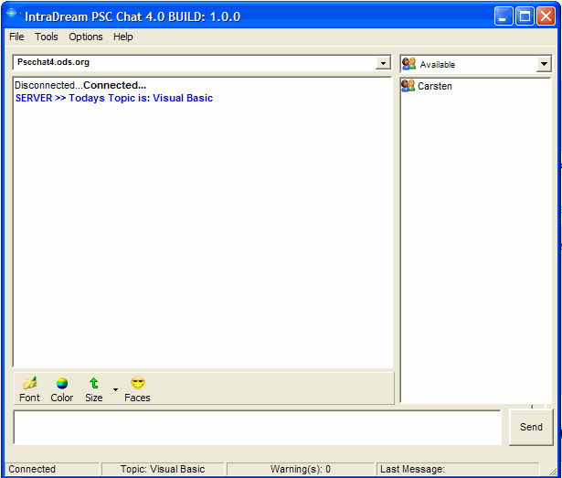



## PSC Chat 4 Beta 1

### Description

PSC Chat 4 is a Chat room we made for pscode.com this new version supports rtf, Private Messaging, Web Cam support, Whiteboard and a hole lot more. I hope that all of you try PSC Chat4 and hope that you enjoy this new version of Psc Chat. We have been testing this edition for a long time and have found a few bugs which have been removed. But before we make the final release of PSC Chat we would like to have more testing done to PSC chat. This beta version works perfect as far as we tested but of course there will always be some bugs that weren’t discovered while the main testing took place. We hope to have the Server running 24/7, so if you find the servers down please don’t be mad and give up your hopes. Also be sure to extract the converter.zip inside the folders of Client XP and Client 9x. And I would also like to thank everyone that participated in this project. The IntraDream Team, Carsten Dressler, Timothy Marin
 
### More Info
 

             |
---                |---
**Submitted On**   |2003-04-19 14:55:36
**By**             |[Carsten Dressler](https://github.com/Planet-Source-Code/PSCIndex/blob/master/ByAuthor/carsten-dressler.md)
**Level**          |Advanced
**User Rating**    |4.9 (177 globes from 36 users)
**Compatibility**  |VB 6\.0
**Category**       |[Internet/ HTML](https://github.com/Planet-Source-Code/PSCIndex/blob/master/ByCategory/internet-html__1-34.md)
**World**          |[Visual Basic](https://github.com/Planet-Source-Code/PSCIndex/blob/master/ByWorld/visual-basic.md)
**Archive File**   |[PSC\_Chat\_41576464192003\.zip](https://github.com/Planet-Source-Code/carsten-dressler-psc-chat-4-beta-1__1-44874/archive/master.zip)

